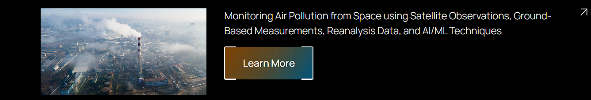
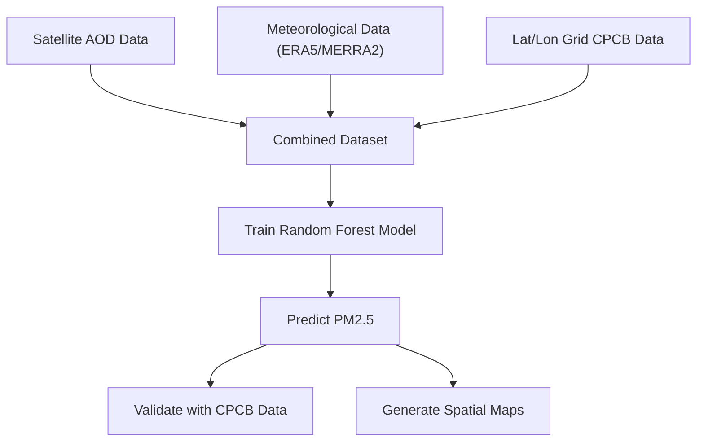
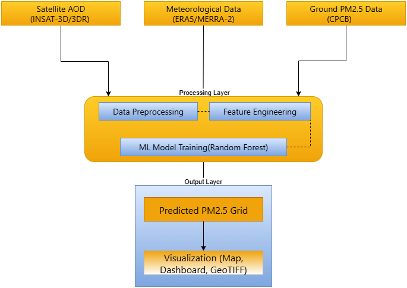
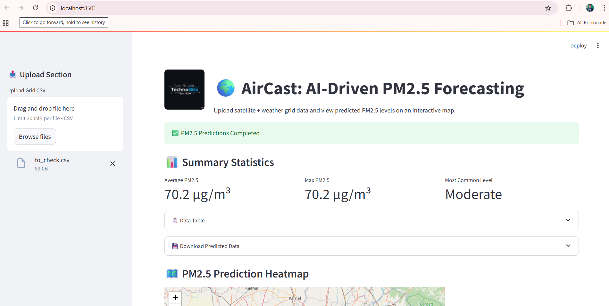
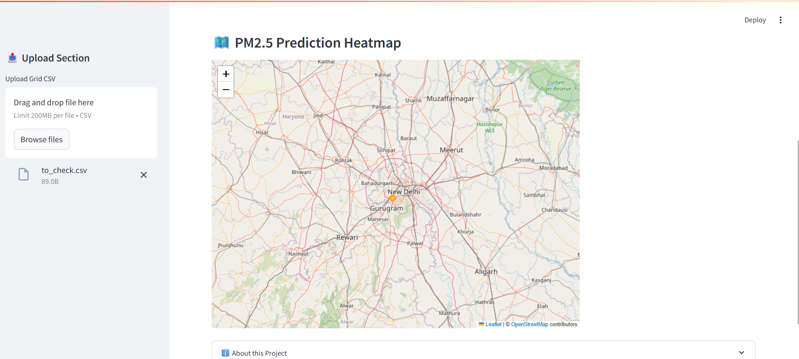
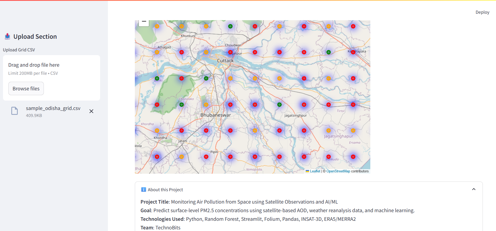
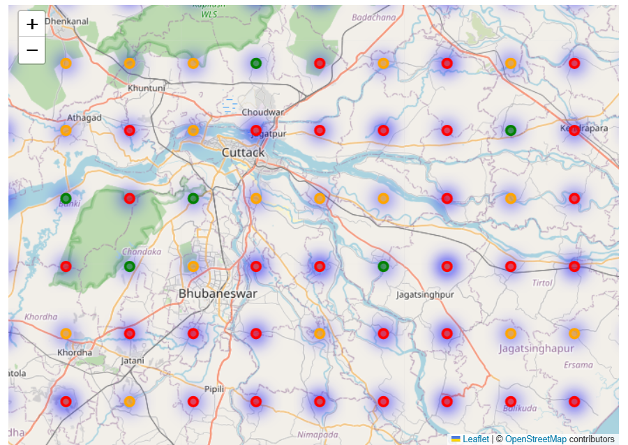
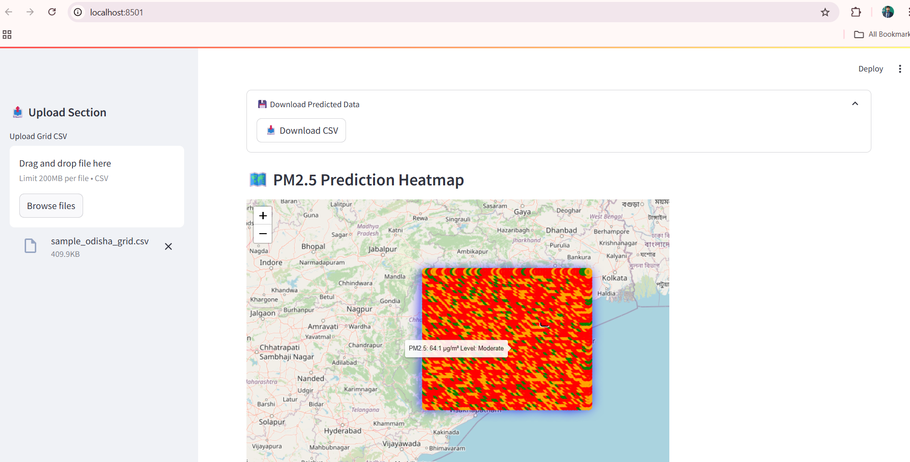
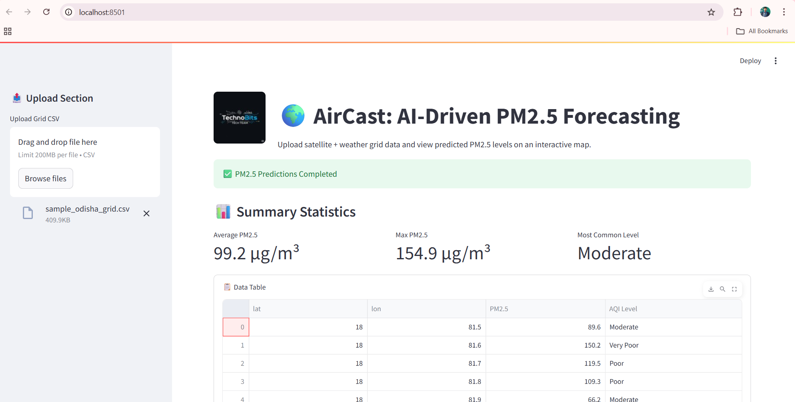

# 🌍 Monitoring Air Pollution from Space using Satellite Observations and AI/ML

> 🚀 A hackathon project developed for the **ISRO Hackathon 2025**, focused on estimating surface-level PM2.5 concentration using satellite-derived AOD, reanalysis meteorological data, and machine learning models.

---
<p align="center">
  
</p>

> 🛰️ This project is based on the official Problem Statement from the **ISRO-BAH Hackathon 2025**.  
> You can explore the full details of the problem statement on the official platform:

🔗 **[Click here to view the problem overview](https://vision.hack2skill.com/event/bah2025?utm_source=hack2skill&utm_medium=homepage)**  

---
## 🧠 Problem Statement

Air pollution, especially PM2.5, is a critical environmental issue. Consistent and large-scale monitoring remains a challenge due to limited ground stations. This project aims to build a scalable AI/ML pipeline that:

- Estimates surface-level **PM2.5 concentrations** using **Aerosol Optical Depth (AOD)** data from satellites.
- Integrates **reanalysis meteorological parameters** (wind, temperature, humidity, boundary layer height).
- Generates **spatial PM2.5 prediction maps** for entire regions (e.g., Odisha/India).

---

## 🎯 Objectives

-   Predict PM2.5 levels from AOD and meteorological inputs using **Random Forest regression**.
-   Visualize PM2.5 as interactive maps and static heatmaps.
-  Validate model predictions using CPCB ground-station data.
-  Enable reproducibility via scripts, trained models, and visualization outputs.

---

## 🗃️ Dataset Sources

| Dataset Type | Source |
|--------------|--------|
| 🛰️ AOD (Aerosol Optical Depth) | INSAT-3D/3DR (simulated for demo) |
| 🌦️ Meteorological Data | ERA5 / MERRA-2 (temperature, RH, wind u/v, PBL height) |
| 🏭 PM2.5 Ground Truth | CPCB Station Data (simulated) |
| 🌍 Geographic Grid | Lat/Lon Grid over Odisha (~10km resolution) |

---

## 🛠️ Tech Stack

- **Python** (pandas, numpy, scikit-learn, matplotlib, seaborn, rasterio)
- **Machine Learning:** Random Forest Regressor
- **Visualization:** Folium, Matplotlib, GeoTIFF
- **Deployment:** Streamlit (for interactive demo)

---

## 📈 Workflow & Methodology



## 🏗️ Project Architecture


> 📌 *This diagram illustrates the full pipeline from data input to prediction and visualization.*
It includes:
- Input sources like satellite AOD (INSAT-3D/3DR), meteorological data (ERA5/MERRA-2), and CPCB ground truth.
- A processing layer for data preprocessing, feature engineering, and Random Forest model training.
- Output layer showing predicted PM2.5 and its visualizations.

---

## 🚀 Getting Started

Follow these steps to set up and run the project locally.

### 📦 Prerequisites

Make sure you have the following installed:

- Python 3.8+
- pip (Python package manager)
- Git (to clone the repository)

### 🛠️ Installation

1. **Clone the repository**
   ```bash
   git clone https://github.com/pSahoo-456/pm2.5-monitoring.git
   cd pm2.5-monitoring

2. **Create and activate a virtual environment**
    ```bash
    python -m venv venv
    source venv/bin/activate         # On macOS/Linux
    venv\Scripts\activate            # On Windows
3.  **Install the required dependencies**
    ```bash
    pip install -r requirements.txt

---
##  🚀 How to use the system - Running the Streamlit App

- Make sure your model and data files are placed in the correct directories.

- Then launch the app:
    ```bash
    streamlit run app.py

This will open the web interface in your browser 

---
## 🔍 Insightful Outputs of Our Air Monitoring System
### 💡 1. Prediction Interface – Streamlit View
  
The main interface of our platform built using Streamlit, where users:
- Upload `.csv` data  
- Get prediction status  
- View model output with labels such as *Moderate*, *Poor*, etc.

---

### 🔥 2. Heatmap View of PM2.5 Concentrations
  
This heatmap shows the predicted PM2.5 concentration in the Delhi-NCR area. 
The heat distribution helps identify pollution hotspots and gradients.  
Areas with higher pollution are more intensely colored.  
This map is generated using Folium + Leaflet + Streamlit integration.

---


### 📍 3. Regional Dot-Grid View with Upload
  
This is an interactive map interface where users upload a grid CSV and get PM2.5 values displayed as color-coded dots.  
The platform supports uploading custom satellite grid data, which is then visualized dynamically.

---
### 🗺️ 4. PM2.5 Dot Map View (Zoomed into Odisha)
  
This image shows zoomed-in PM2.5 predictions using colored dot markers across the Odisha region.  
- Red indicates high PM2.5 levels  
- Green/Yellow indicates lower/moderate levels  
- Gives clear spatial pollution distribution.

---

### 🌡️ 5. Grid-Based Heatmap Prediction Result
  
This output visualizes PM2.5 prediction across a wider region, highlighting polluted zones based on predicted AQI values.  
Each point shows predicted concentration and air quality level on hover.

---

### 📊 6. Summary Statistics Output
  
Displays average, maximum PM2.5, and most common AQI level in the uploaded dataset.  
Includes an interactive data table showing:
- Latitude, longitude  
- Predicted PM2.5 values  
- AQI level (e.g., Moderate, Poor, Very Poor)

---

##  📊 Model Evaluation & Performance

---
## 🧪 Results & Achievements

---
##  👨‍💻 Meet the Team / 🙌 Project Contributors

- Prakash Sahoo(Team Lead): 
- Susmita Das: 
- Manohar Kumar Shah: 
- Bikash Ranjan Ghadai: 

---
## ⚠️ Current Limitations

---
##  Future Scope & Improvements

---
##  🌐 Live Demo

---
## 🧩 Troubleshooting

---
##  📄 License

---
##  📬 Contact & Support
- Prakash Sahoo
- 📧 Email: prakash2004sahoo@gmail.com 
- 📞 Phone: +91-9668187814
