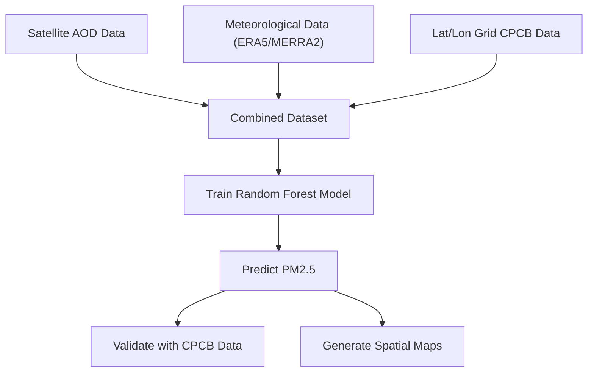

# 🌍 Monitoring Air Pollution from Space using Satellite Observations and AI/ML

> 🚀 A hackathon project developed for the **ISRO Hackathon 2025**, focused on estimating surface-level PM2.5 concentration using satellite-derived AOD, reanalysis meteorological data, and machine learning models.

---

## 🧠 Problem Statement

Air pollution, especially PM2.5, is a critical environmental issue. Consistent and large-scale monitoring remains a challenge due to limited ground stations. This project aims to build a scalable AI/ML pipeline that:

- Estimates surface-level **PM2.5 concentrations** using **Aerosol Optical Depth (AOD)** data from satellites.
- Integrates **reanalysis meteorological parameters** (wind, temperature, humidity, boundary layer height).
- Generates **spatial PM2.5 prediction maps** for entire regions (e.g., Odisha/India).

---

## 🎯 Objectives

- 📌 Predict PM2.5 levels from AOD and meteorological inputs using **Random Forest regression**.
- 📌 Visualize PM2.5 as interactive maps and static heatmaps.
- 📌 Validate model predictions using CPCB ground-station data.
- 📌 Enable reproducibility via scripts, trained models, and visualization outputs.

---

## 🗃️ Dataset Sources

| Dataset Type | Source |
|--------------|--------|
| 🛰️ AOD (Aerosol Optical Depth) | INSAT-3D/3DR (simulated for demo) |
| 🌦️ Meteorological Data | ERA5 / MERRA-2 (temperature, RH, wind u/v, PBL height) |
| 🏭 PM2.5 Ground Truth | CPCB Station Data (simulated) |
| 🌍 Geographic Grid | Lat/Lon Grid over Odisha (~10km resolution) |

---

## 🛠️ Tech Stack

- **Python** (pandas, numpy, scikit-learn, matplotlib, seaborn, rasterio)
- **Machine Learning:** Random Forest Regressor
- **Visualization:** Folium, Matplotlib, GeoTIFF
- **Deployment (optional):** Streamlit (for interactive demo)

---

## 📈 Workflow & Methodology

